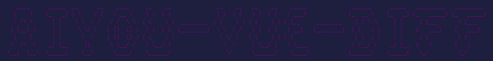
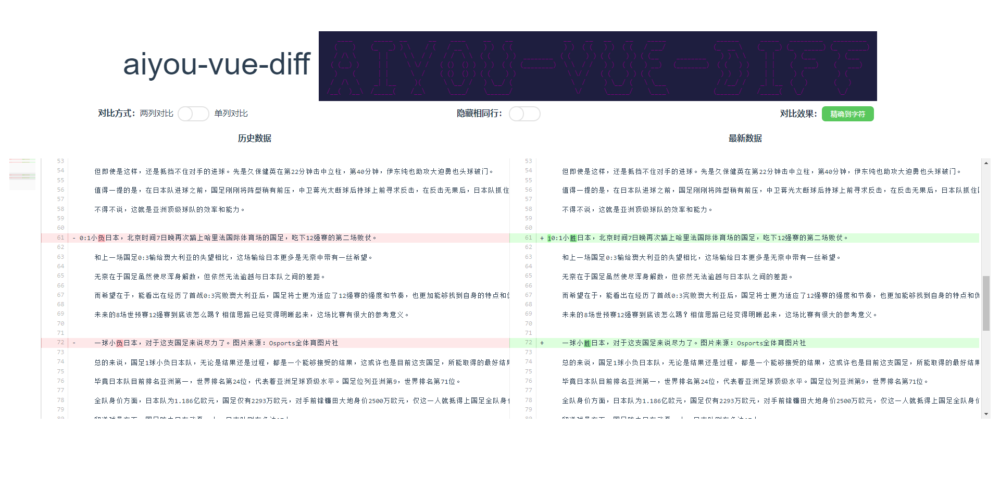

<p align="center">
    
</p>

# # aiyou-vue-diff（Vue的文本对比组件）- 哎呦系列


- [🔥 功能列表](##功能列表)
- [📚 功能列表](##参数列表)
- [✨ 使用介绍](#使用介绍)
- [🚀 快速上手](#快速上手)
- [📞 社区交流](#社区交流)

---

## aiyou-vue-diff 是什么鬼？

aiyou-vue-diff 是**哎呦系列**中，vue的文本对比工具，也可以用于对比代码，非常的方便，没有什么花里胡哨的功能，全是实用的,谁用谁爽[狗头保命]，常规的操作，非常的简单。

- ⚡ 易用：常规的操作，先引用，再使用，作为vue组件来使用。
- 💉 强大：只需要引入组件，然后使用即可，一共就三个参数，并且这三个参数都有默认值。
- ⚙️️ 简单: 只有 3 个 参数，分别是 longText、topHeight、containerHeight，分别是新旧数据的对象、上方操作区域的高度、对比容器高度。

| nodejs | npm   | size   |
| ------ | ----- | ------ |
| > 12.0  | > 6.0 | 有点，不过这没啥办法 |

## 🔥 功能列表

aiyou-vue-diff，一个简单的vue组件，引入之后、正常注册组件、传递参数：


| 功能                                  | 描述                                                              |
| ------------------------------------- | ------------------------------------------------------------------ |
| 对比方式                           | 支持单列对比 和 双列对比                       |
| 隐藏相同行      | 支持隐藏内容相同的行               |
| 对比效果 | 支持精确到单词 和 精确到字符      |
| 小地图 | 左侧的迷你小地图      |
| ...         | 后续功能待优化     |

## 📚 参数列表

| params                                   | 参数值                                                              |
| ------------------------------------- | ------------------------------------------------------------------ |
| longText                            | { A: `老的文本内容`, B: `新的文本内容` }                           |
| topHeight      | 默认值是 100px                     |
| containerHeight | 默认值 50vh       |
| ...         | 后续功能待优化     |

---

## ✨ 使用介绍

### ⚔️ 安装指南

依赖安装：

```bash
    npm install aiyou-vue-diff
```

### 📈 使用方法

安装完毕依赖之后，通过引入的方式来使用它：

```vue
<template>
  <div id="app">
    <aiyou-vue-diff
      :longText="longText"
      topHeight="100px"
      containerHeight="500px"
    ></aiyou-vue-diff>
  </div>
</template>

<script>

import AiyouVueDiff from "aiyou-vue-diff";

export default {
  name: "App",
  components: {
    AiyouVueDiff,
  },
  data() {
    return {
      longText: {
        A: `内容1`,
        B: `内容2`,
      },
    };
  },
};
</script>

<style>
#app {
}
</style>
```
---

### 😎 浮夸的效果



---

## 🚀 快速上手

**安装**->**使用**

github仓库中有相关的使用demo


## 代码仓库

[github 链接](https://github.com/aiyoudiao/aiyou-vue-diff)

## 📞 社区交流

aiyou-vue-diff 是**哎呦系列**中一员，之后还会有其它的成员陆续上来。

有问题可以在github的issue中提哟，感兴趣也可以加微信交流：


### 感谢以下开源项目

diff：对比两个文本内容，生成一个对比后的js对象
diff2html：将对比后的内容转成html来显示
pagemap：没有直接下载这个依赖，而是把这个依赖的文件拷贝了一份，然后改了改里面的内容，让它支持我。


